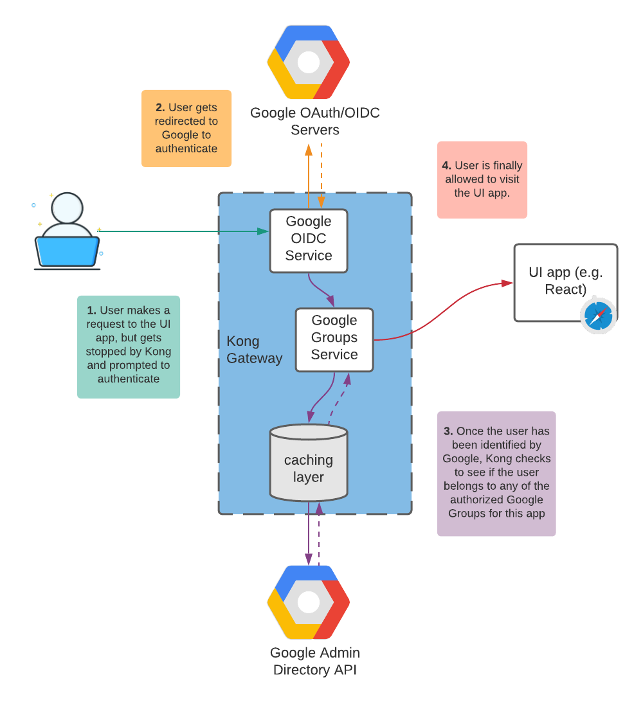

# Kong Google OIDC Google Groups
This library is a Kong Gateway Plugin built in Lua, which authenticates your Kong upstreams using Google OIDC (Open ID Connect),
and authorizes them based on what groups they belong to in your Google Workspace.

# Installation

```bash
luarocks install kong-oidc-google-groups
```

Make sure you set your `KONG_PLUGINS` environment variable such that it reflects this plugin:

```bash
export KONG_PLUGINS=bundled,oidc-google-groups
```

## Notes
Depending on your setup, you may want to make sure your host that runs Kong also has the following 
Linux packages (as the luarocks installation of certain dependencies requires them):

- curl 
- gcc 
- musl-dev

Often a clean way of doing this is creating your own Docker image that uses Kong as a base image, but installs these 
packages in the build steps. 

# How it works



# Requirements
* Kong DB (does not work in db-less mode)
* Service account, loaded into env var: GOOGLE_APPLICATION_CREDENTIALS

# Dependencies

## Infrastructure dependencies
- Google Workspace (formally "Gsuite") organization
- A Google Cloud Platform service account with domain-wide delegation turned, and authorized in your Google 
  Worskpace with proper scopes. [See instructions](https://developers.google.com/admin-sdk/directory/v1/guides/delegation)
- Enable the Google Directory API in Google Cloud Platform
- Set up a GCP OAuth client (and thus a Client ID and Client Secret) and consent screen. [See instructions](https://developers.google.com/identity/protocols/oauth2/openid-connect)
- Create one or more groups and add users to them in Google Workspace. These will be your "allowed groups" for Google 
  Groups based authorization after OIDC authentication is done.
- Kong (This plugin tested in production w/ version 2.2)
  
## Plugin dependencies
The following are some of the main software dependencies for this plugin. The Rockspec will automatically load these.
- [lua-resty-openidc](https://github.com/zmartzone/lua-resty-openidc) 
- [lua-resty-jwt](https://github.com/SkyLothar/lua-resty-jwt)


# Configuration

| Parameter                 | Default          | Required? | Description                                                                                                                                                                                  |
|---------------------------|------------------|-----------|----------------------------------------------------------------------------------------------------------------------------------------------------------------------------------------------|
| client_id                 |                  | Yes       | The OAuth Client ID of your client in GCP used for performing OIDC auth                                                                                                                      |
| client_secret             |                  | Yes       | The OAuth Client Secret of your client in GCP used for performing OIDC auth                                                                                                                  |
| service_account           |                  | Yes       | The json string representation of your GCP service account                                                                                                                                   |
| admin_user                |                  | Yes       | The email address of a user in your Google Workspace who has admin privileges. This is used to look up info on the Google Directory API                                                      |
| allowed_groups            | {}               | No        | A list of email addresses of groups in your org that you want to authorize. Any user belonging to one of these groups will be let through. If left blank, all users will be allowed through. |
| paths                     | {"/"}            | No        | A list of paths to apply this plugin to                                                                                                                                                      |
| methods                   | all HTTP methods | No        | A list of HTTP methods (e.g. GET, POST) to apply this plugin to.                                                                                                                             |
| db_cache_period_secs      | 300              | No        | The time period in seconds for which to cache Google Group membership information. This helps reduce latency and API calls to the Google Directory API                                       |
| redirect_uri_path         | /cb              | No        | Where to redirect from OIDC                                                                                                                                                                  |
| logout_path               | /logout          | No        | Absolute path used to logout from the OIDC RP                                                                                                                                                |
| redirect_after_logout_uri | /                | No        | Where to redirect to after logout                                                                                                                                                            |
| recovery_page_path        | /                | No        | Where to redirect to on OIDC failure                                                                                                                                                            |
| anonymous                 |                  | No        | Consumer ID to use as an "anonymous" consumer if auth fails. Used for "logical OR" in Kong multiple authentication.                                                                                                                                                            |

# Development
## Publishing to LuaRocks
1. Update the Rockspec file name and version 
2. Update the git tag when ready for a release: `git tag v0.1-0`
3. Run `git push`
4. If authorized, follow the instructions here to upload https://github.com/luarocks/luarocks/wiki/Creating-a-rock
